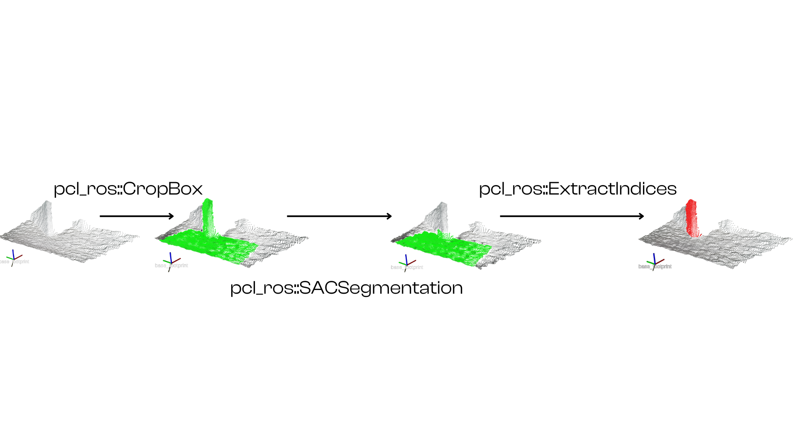
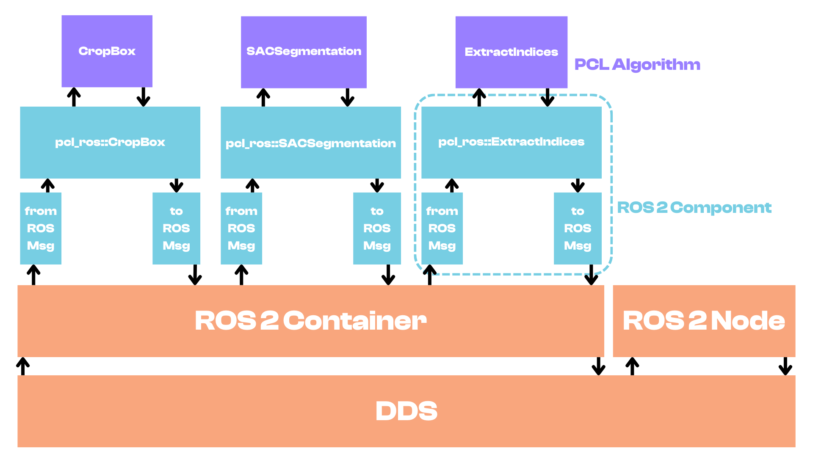
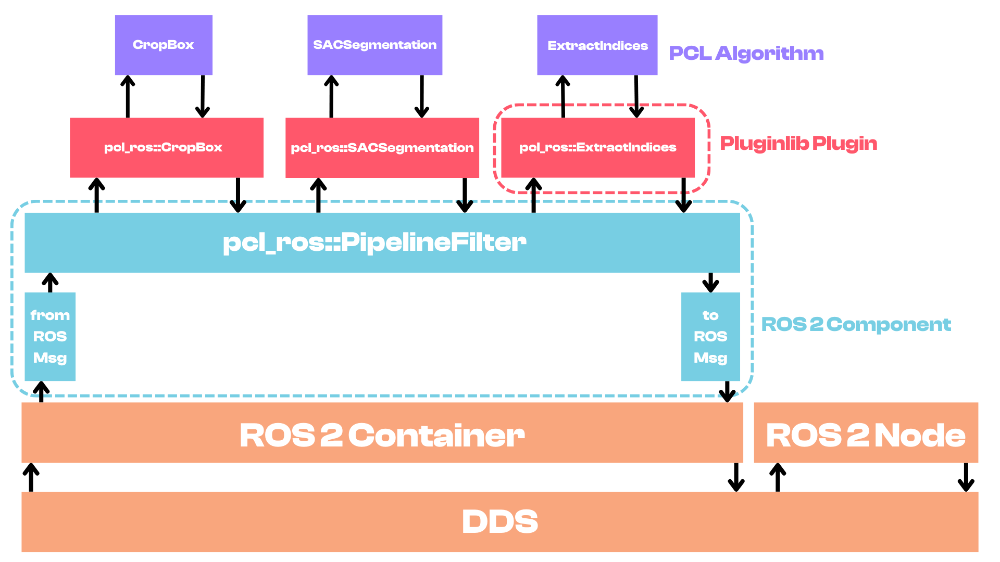
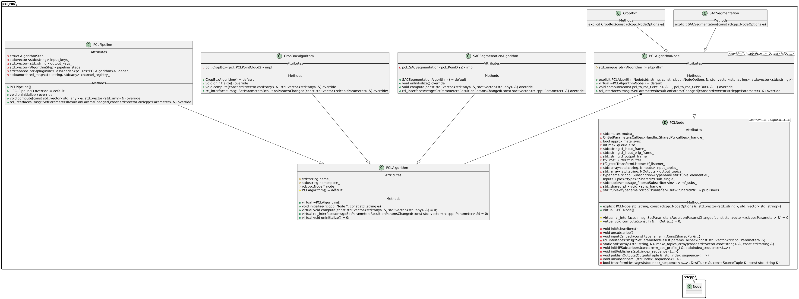
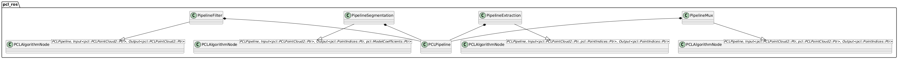

# Perception PCL
This package provides a C++ ROS 2 wrapper for the [Point Cloud Library (PCL)](https://pointclouds.org/) to facilitate 3D perception tasks such as point cloud processing, filtering, segmentation, and feature extraction.

Its purpose is to expose as many algorithms in the PCL library as possible, both as [ROS 2 Components](https://docs.ros.org/en/humble/Concepts/Intermediate/About-Composition.html) and as plugins that can be loaded with [pluginlib](https://docs.ros.org/en/humble/Tutorials/Beginner-Client-Libraries/Pluginlib.html), so that they can easily be integrated and composed in larger and more complex perception pipelines.



Such pipelines can be created and composed at runtime using either ROS 2 Launch files or using YAML configuration files, depending on whether you are composing PCL algorithms as Components or as pluginlib plugins.

## Using ROS 2 Components
The pipeline above can be composed by loading each PCL algortihm as a separate ROS 2 Composable Node into a single container node.

```python
import launch
from launch_ros.actions import ComposableNodeContainer
from launch_ros.descriptions import ComposableNode

def generate_launch_description():
    filter_roi_config = {
        # Parameters for ROI extraction
    }
    plane_segmentation_config = {
        # Parameters for Plane Segmentation
    }
    extract_indices_config = {
        # Parameters for Extracting Plane Indices
    }
    rgbd_container = ComposableNodeContainer(
            name='rgbd_container',
            namespace='',
            output='screen',
            emulate_tty=True,
            package='rclcpp_components',
            executable='component_container',
            composable_node_descriptions=[
                # Extract ROI area
                ComposableNode(
                    package='pcl_ros',
                    plugin='pcl_ros::CropBox',
                    name='filter_roi',
                    namespace='',
                    parameters=filter_roi_config['parameters'],
                    remappings=filter_roi_config['remappings'],
                ),
                # Plane Segmentation
                ComposableNode(
                    package='pcl_ros',
                    plugin='pcl_ros::SACSegmentation',
                    name='plane_segmentation',
                    namespace='',
                    parameters=plane_segmentation_config['parameters'],
                    remappings=plane_segmentation_config['remappings'],
                ),
                # Extract Plane Outliers
                ComposableNode(
                    package='pcl_ros',
                    plugin='pcl_ros::ExtractIndices',
                    name='extract_indices',
                    namespace='',
                    parameters=extract_indices_config['parameters'],
                    remappings=extract_indices_config['remappings'],
                ),
            ],
        )
    return launch.LaunchDescription([rgbd_container])
```

## Using Pluginlib Plugins

The pipeline above can also be composed by loading each PCL algorithm as a separate plugin using pluginlib.

```yaml
my_pipeline:
    ros__parameters:
        approximate_sync: true
        input_frame: "base_footprint"
        output_frame: "base_footprint"
        plugins: ["filter_roi", "plane_segmentation", "plane_extract_indices"]

        input_keys: ["raw_cloud"]
        output_keys: ["obstacles_cloud"]

        filter_roi:
            plugin: "pcl_ros::CropBox"
            inputs: ["raw_cloud"]
            outputs: ["cloud_roi"]
        
            # CropBox parameters for ROI extraction

        plane_segmentation:
            plugin: "pcl_ros::SACSegmentation"
            inputs: ["cloud_plane_area"]
            outputs: ["plane_inliers", "plane_model"]
            
            # SACSegmentation parameters for Plane Segmentation

        plane_extract_indices:
            plugin: "pcl_ros::ExtractIndices"
            inputs: ["cloud_plane_area", "plane_inliers"]
            outputs: ["obstacles_cloud"]
            negative: true # extract points that are part of the plane

```

And you can launch the pipeline using a launch file like this:

```python
import launch
from launch_ros.actions import ComposableNodeContainer
from launch_ros.descriptions import ComposableNode

def generate_launch_description():
    my_pipeline_config = {
        # Path to the YAML configuration file
    }
    rgbd_container = ComposableNodeContainer(
            name='rgbd_container',
            namespace='',
            output='screen',
            emulate_tty=True,
            package='rclcpp_components',
            executable='component_container',
            composable_node_descriptions=[
                # Pipeline Wrapper
                ComposableNode(
                    package='pcl_ros',
                    plugin='pcl_ros::PipelineFilter',
                    name='my_pipeline',
                    namespace='',
                    parameters=my_pipeline_config['parameters'],
                    remappings=my_pipeline_config['remappings'],
                ),
            ],
        )
    return launch.LaunchDescription([rgbd_container])
```

## Overview
The first important topic to cover is: which approach should you use to compose your perception pipelines? The answer largely depends on your use case and requirements:
- If you need maximum **flexibility** and the ability to dynamically compose your pipelines at runtime, then using **ROS 2 Components** is the way to go.
  
- If you already have a well-defined set of perception algorithms and configurations that you want to use consistently across different projects, then using **pluginlib plugins** is way more **efficient**.
  

Both approaches allows you to dynamically change the parameters of each loaded PCL algorithm at runtime, so let's focus on the main difference which is **Efficiency** vs **Flexibility**.

Specifically, using pluginlib plugins is more efficient because you only need to load a single ROS 2 Component that internaly manages the PointClouds as PCL data structures and passes them between the loaded plugins, instead of having to serialize and deserialize the PointClouds as ROS 2 messages between each Component.


## Software Architecture



> :warning: `CropBox` and `SACSegmentation` classes are just some of the available PCL algorithms exposed as plugins and ROS 2 Components and just serve as an example to illustrate the software architecture.

### PCL Node
The `PCLNode` class cointains the common functionalities to interface a generic PCL algorithm or PCL pipeline with ROS 2.
It uses variadic templates to support an arbitrary number of input and output types, making it highly flexible and reusable for different PCL algorithms.
It manages:
* Subscription to input topics
* Syncronization of input messages using MessageFilters
* Publication of output topics
* Conversion between ROS 2 messages and PCL data structures
* Transformations between different coordinate frames using TF2

### PCL Algorithm
The `PCLAlgorithm` class is a type-ereased base class that defines the interface for all PCL algorithms to be exposed as plugins with `pluginlib`.
All the PCL algorithms must inherit from this class and implement the `compute()` and `onParamsChanged` methods.
It simply abstracts any PCL algorithm to provide a common interface for the `pluginlib` to interact with.

### PCL Algrotithm Node
The `PCLAlgorithmNode` class is used to expose a generic `PCLAlgorithm` as a ROS 2 Component.
It is a template base class that inherits from `PCLNode` and can be specialized with a specific  `PCLAlgorithm`, combining their functionalities to create a ROS 2 Node that can run a specific PCL algorithm.

### PCL Pipeline
The `PCLPipeline` class is a special `PCLAlgorithm` that uses `pluginlib` to load multiple PCL algorithms as plugins and run them sequentially to create a complete perception pipeline.
It manages the data flow between the loaded plugins, passing the PCL data structures from one plugin to the next.
It also handles the configuration of the pipeline using a YAML file, allowing users to easily define and customize their perception pipelines.

By inheriting from the `PCLAlgorithm` class, the `PCLPipeline` can be exposed as a plugin itself, allowing users to load entire perception pipelines as a single plugin using `pluginlib`.
Furthermore, a `PCLPipeline` can be exposed as a ROS 2 Component by specializing the `PCLAlgorithmNode` class, enabling users to load and run complex perception pipelines as ROS 2 Components.

The available `PCLPipelines` ROS 2 Components are distinguished by the type and the number of input and output tehy take:

* `PipelineFilter`: for pipelines that take a point cloud as input and output a filtered point cloud.
* `PipelineSegmentation`: for pipelines that take a PointCloud as input and output segmentation results such as point indices and model coefficients.
* `PipelineExtraction`: for pipelines that take a PointCloud and point indices as input and output a PointCloud with the extracted points.
* `PipelineMux`: for pipelines that take multiple PointClouds as input and output a single PointCloud.

Other types of pipelines can be easily added by specializing the `PCLAlgorithmNode` class with different input and output types.



